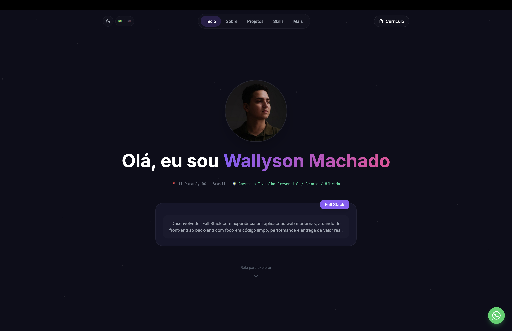
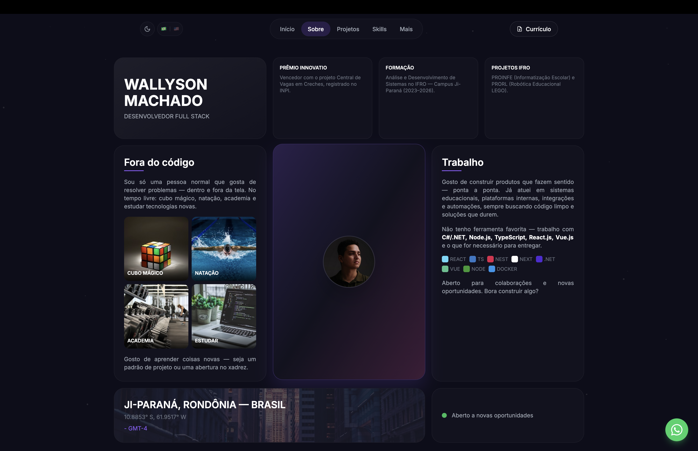
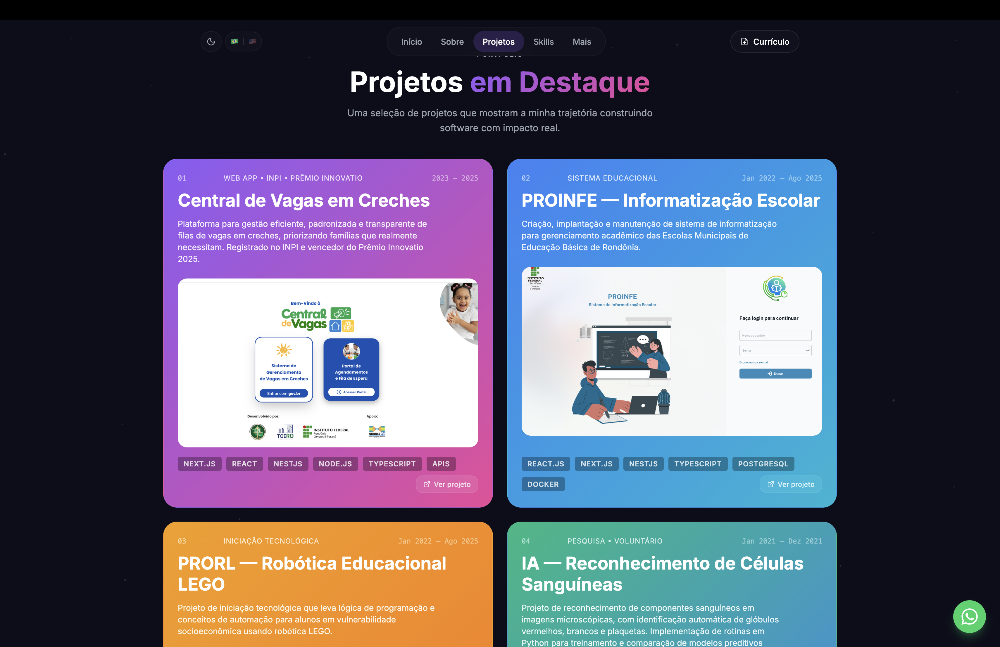
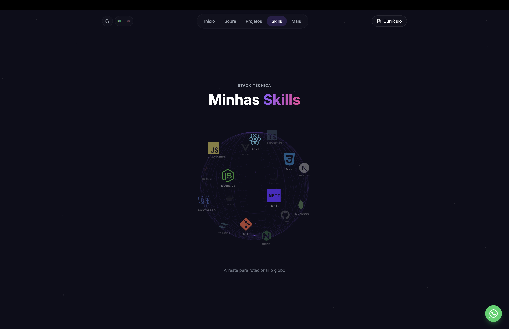

# Wallyson Machado de Lima

  
  

---

## 🚀 Sobre Mim

Desenvolvedor Full Stack com experiência no desenvolvimento de aplicações web, atuando tanto no front-end quanto no back-end com foco em performance, organização e entrega de soluções funcionais. Possui vivência com **Next.js**, **React.js**, **Vue.js**, **Node.js**, **NestJS**, **TypeScript**, **C#/.NET** e **MySQL**, além de conhecimento em infraestrutura, **APIs**, containers e automações. Atua em projetos acadêmicos e institucionais, contribuindo para a construção de sistemas modernos e aderentes às necessidades do negócio.

- 🔭 Trabalhando em projetos **Full Stack**.
- 🌱 Aprendendo **Python, Java.**
- 💡 Interessado em **Resolver problemas reais com tecnologia**
- 📫 Email: **machadodelimawallyson@gmail.com**
- 💬 WhatsApp: **(69) 99357-5324**

---

## 🛠️ Tech Stack

### Frontend

### Backend

### Database & Tools

### Mobile & Desktop

---

## 🌐 Meu Portfólio

---

## 🤝 Conecte-se Comigo

---

  

